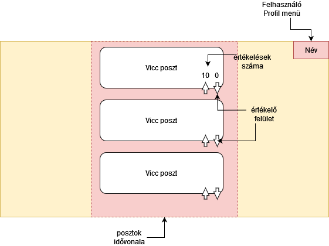

# Funkcionális Specifikáció

## Áttekintés
A viccportál egy olyan online platformot jelent, amely a felhasználók szórakoztatását és humorral való kikapcsolódását tűzi ki célul. Az alábbiakban bemutatjuk a projekt általános célját és funkcionális jellemzőit:

- **Cél és Szándék**
    * A viccportál célja a felhasználók szórakoztatása és humorral való kikapcsolódás lehetőségének biztosítása. Az alapvető szándék az, hogy egy olyan online közösségi platformot hozzunk létre, ahol vicceket lehet olvasni, megosztani és értékelni, ezeket kategorizálni tartalmuk szerint és a viccek között szűrni tartalmuk szerint.

- **Viccek és Humor**
    * A felhasználóknak lehetőségük lesz könnyedén böngészni és olvasni különböző kategóriákba sorolt vicceket. A cél a jókedv, a humor és a nevetés elősegítése, valamint a kliens viccgyűjteményének tartósítása és megosztása a világgal.

- **Kategóriák és Tartalom**
    * A viccportálon különböző kategóriákba sorolt viccek találhatók, így mindenki megtalálhatja a neki tetsző és érdeklődési körének megfelelő tartalmat, és szűrők segítségével csak az általa kedvelt vicceket böngészheti.

- **Felhasználói Közösség**
    * A portál egy közösségi platformként is működik, lehetőséget biztosítva a felhasználóknak a viccek megosztására és értékelésére és kategorizálására. A felhasználók interakciója és visszajelzései fontosak a közösségi élmény szempontjából.

- **Hozzáférés Bárhonnan** 
    * A viccportál weben elérhető lesz, így beleértve a számítógépeket, tableteket és mobiltelefonokat is, hogy minél több felhasználó számára legyen hozzáférhető. A webfelület kizárólagosan számítógépre lett tervezve, ezért mobilkészülékeken használata nehezebnek bizonyulhat.

- **Ingyenes Regisztráció és Használat** 
    * A rendszer ingyenesen elérhető és használható, regisztrációhoz csak egy felhasználónévre és jelszóra van szükség, így bárki bárhonnan könnyedén hozzáférhet a humoros tartalmakhoz.

A viccportál létrehozásának fő célja egy vidám, barátságos és interaktív közösség kialakítása, amely elősegíti a jókedvet és a nevetést a felhasználók számára, valamint a kliens jelenleg papíron tárolt vicc gyűjteményének tartósítása és megosztása a világgal, valamint ennek bővítése.

## Jelenlegi helyzet - Viccportál

A viccportál létrehozására az alábbi okokból van szükség:

- **Szórakoztatás és Kikapcsolódás** 
    * Az emberek mindennapjaik során gyakran szembesülnek stresszel és nyomással. Ebben a gyors tempójú világban szükség van olyan platformokra, amelyek lehetőséget kínálnak a humor és a nevetés által való kikapcsolódásra. A viccportál ezt a szórakoztatási és kikapcsolódási igényt kívánja kielégíteni.

- **Közösség és Interakció** 
    * A humort és vicceket gyakran megosztják barátok és családtagok között. A viccportál egy olyan közösségi platformot teremt, ahol a felhasználók interakcióba léphetnek egymással, megoszthatják saját humoros történeteiket és értékelhetik mások vicceit. Ez elősegíti az online közösség és szórakoztatás összekapcsolását.

- **Humor Terjedése**
    * A viccportál lehetőséget biztosít a felhasználóknak arra, hogy vicceket terjesszenek és megosszanak. Ez hozzájárul a humor terjedéséhez és az emberek közötti pozitív kötődés kialakításához.

- **Hozzáférés Bárhonnan** 
    * A viccportál a szórakoztató tartalmakhoz való hozzáférést bárki számára lehetővé teszi, bármely eszközön, legyen az számítógép, tablet vagy mobiltelefon. Ez a rugalmasság segít abban, hogy minél több ember számára elérhető legyen a humoros tartalom.

- **Ingyenes Használat**
    * A viccportál ingyenesen elérhető és használható mindenki számára, így nincsenek akadályok a szórakozás és humor megosztása előtt.

## Követelménylista

| ID | Név                          | Kifejtés                                                                                               |
|----|------------------------------|--------------------------------------------------------------------------------------------------------|
| k1 | Viccek megjelenítése          | A programnak könnyen érthető módon meg kell jelenítenie a vicceket a felhasználóknak közösségi média szerű idővonal által.               |
| k2 | Vicc kategóriák kezelése      | A viccportálnak lehetőséget kell biztosítania viccek csoportosítására kategóriákba, ezeket Tag-ekkel valósítjuk meg. |
| k3 | Vicc hozzáadása               | A felhasználóknak képesnek kell lenniük vicceket hozzáadni a portálhoz, amelyek megjelennek az adott kategóriában. |
| k4 | Vicc értékelése               | A felhasználóknak lehetőséget kell biztosítani az egyes viccek értékelésére, például "tetszik" vagy "nem tetszik" gombokkal. |
| k5 | Vicc megosztása               | A felhasználóknak lehetőséget kell biztosítani a viccek közösségi médiában történő megosztására.         |
| k6 | Felhasználói értékelések      | A programnak képesnek kell lennie követni a felhasználók viccekkel kapcsolatos értékeléseit, és ezt visszaállítani azoknak, akik visszaélnek az értékelési lehetőséggel. |

## Használati esetek

A viccportál használati eseteit a különböző felhasználói szerepkörök alapján határozzuk meg. Az alábbiakban bemutatjuk, hogy melyik felhasználó milyen funkciókat tud használni:

### Felhasználók (Regisztrált **és** Nem Regisztrált):
- **Vicc Olvasása**: Minden felhasználó képes vicceket böngészni és olvasni a portálon, függetlenül attól, hogy regisztráltak-e vagy sem.

### Regisztrált Felhasználók:
- **Saját viccek lista**: Saját feltöltött vicceit láthatja egy helyen a regisztrált felhasználó.
- **Választható Anonimitás**: Választhat, hogy nevével vagy anélkül, anoním módon posztoljon.
- **Bejelentkezés**: A már regisztrált felhasználók beléphetnek a felhasználónév és jelszó segítségével.
- **Viccek Értékelése**: Felhasználók értékelhetik a vicceket, például "tetszik" vagy "nem tetszik" gombokkal.
- **Vicc Megosztása**: Felhasználók megoszthatják saját vicceiket a közösséggel, és megjeleníthetik azokat a portálon.

### Nem Regisztrált Felhasználók:
- **Regisztráció**: Felhasználók regisztrálhatnak a felhasználónév és jelszó segítségével.

## Képernyő Tervek:
