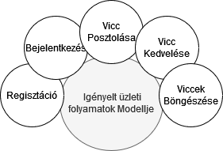

# ViccPortál követelményspecifikáció

## Áttekintés

   Az alkalmazásunk célja egy közösség építése viccekre, poénokra épülve. A portál Webes felületen él, vicc posztjaink tagekkel bekategorizálva (Favicc, Felnőtt, Politikai, stb.), kronológikus sorrendben elérhetőek.

   Ezen vicc posztokat a felhasználók értékelhetik, megjelenítve az értékelések számát és értékét.

## Jelenlegi helyzet

   Kovács Béla egy nagyon tehetséges vicc gyűjtő és költő, aki az összes szabadidejét a legjobb viccek feltárására és azok dokumentálására fordítja. Jelenleg papíron tárolja az eddig gyűjtött vicceit, és szóbeszéd segítségével bővíti a vicctárát. A füzetben a viccek a feljegyzés dátumával és annak a nevével akitől Béla hallotta a viccet vannak eltárolva. A viccek egy szóval vannak kategorizálva ( Székely, anyós, favicc).

## Vágyálom rendszer

   A célunk egy olyan közösségi portál létrehozása,
   mely egy egyszerű, intuitív felhasználói
   felület által kapcsolja össze felhasználóit
   közösség által készített tartalmaival.

   A vágyunk, hogy az oldalunkra lépve szimpla görgetéssel
   eléri közösségünk összes tartalmát, könnyedén maga is
   hozzátehessen a tartalmakhoz, értékelje őket.

## Jelenlegi üzleti folyamatok

- **Vicc beküldése**: A viccportál jelenleg lehetővé teszi a felhasználóknak, hogy kézzel beküldjenek vicceket az oldalra. Ezt egy online űrlap segítségével tehetik meg.

- **Vicc megosztása**: A felhasználók láthatják és megoszthatják vicceiket másokkal.

- **Felhasználói értékelések**: A felhasználók értékelhetik a vicceket, lájkokkal vagy diszlike-okkal.

### A viccportál által kínált megoldás

   A viccportál egy olyan platformot kínálhat, ahol a felhasználók saját maguk tölthetnek fel vicceket. A viccek megosztását azonnal lehetővé tehetik, és a felhasználók valós idejű értékeléseket adhatnak rájuk. Ezenkívül a felhasználók közösségi élményben részesülhetnek, és könnyen megoszthatják kedvenc vicceiket.

   A viccportál megközelítése modernizálná és felgyorsítaná a viccek közzétételét és megosztását, javítva ezzel a felhasználói élményt.

## Igényelt üzleti folyamatok

1. **Regisztráció:**
   - Szeretnék regisztrálni a weboldalon felhasználóként, ahol megadhatok alapvető regisztrációs információkat, például felhasználónév, jelszó és e-mail cím.

2. **Bejelentkezés:**
   - Szeretném, hogy legyen lehetőségem bejelentkezni az oldalra, ha már korábban regisztráltam. Bejelentkezéskor az alapvető hitelesítési adatokat (felhasználónév és jelszó) használom.

3. **Vicc Posztolás:**
   - Az oldalon egyszerű felületet szeretnék, ahol könnyen megoszthatok vicceket más felhasználókkal. A posztolás során szeretném megadni a vicc szövegét és opcionálisan választhassak kategóriát vagy címkéket hozzá.

4. **Vicc Értékelés:**
   - Szeretném látni a felhasználók értékeléseit a vicceimre vonatkozóan. Ez lehetővé teszi, hogy lássam, milyenek a reakciók a vicceimre, például lájkok vagy diszlike-ok formájában.

5. **Viccek Böngészése:**
   - Az oldalon könnyen és hatékonyan szeretnék vicceket böngészni. Kategóriák, címkék segítségével szeretném megtalálni a számomra legérdekesebb vicceket.y

## Igényelt üzleti folyamatok modellje

   

## A rendszerre vonatkozó szabályok

A web felület szabványos ezközökkel készüljön, React és MongoDB segítségével. A felhasználó adatkezelése a GDPR-nek ( General Data Protection Regulation ) meg kell feleljen. A dátumok éééé/hh/nn óó:pp formátumban kell megjelenjenek. A fiók nélküli felhasználók bejegyzései "Anonymous"-ként kell megjelenjenek.

## Követelménylista

| ID | Név                          | Kifejtés                                                                                               |
|----|------------------------------|--------------------------------------------------------------------------------------------------------|
| k1 | Viccek megjelenítése          | A programnak könnyen érthető módon meg kell jelenítenie a vicceket a felhasználóknak.               |
| k2 | Vicc kategóriák kezelése      | A viccportálnak lehetőséget kell biztosítania viccek csoportosítására kategóriákba, például humor, sport, politika stb. |
| k3 | Vicc hozzáadása               | A felhasználóknak képesnek kell lenniük vicceket hozzáadni a portálhoz, amelyek megjelennek az adott kategóriában. |
| k4 | Vicc értékelése               | A felhasználóknak lehetőséget kell biztosítani az egyes viccek értékelésére, például "tetszik" vagy "nem tetszik" gombokkal. |
| k5 | Vicc megosztása               | A felhasználóknak lehetőséget kell biztosítani a viccek közösségi médiában történő megosztására.         |
| k6 | Felhasználói értékelések      | A programnak képesnek kell lennie követni a felhasználók viccekkel kapcsolatos értékeléseit, és ezt visszaállítani azoknak, akik visszaélnek az értékelési lehetőséggel. |
